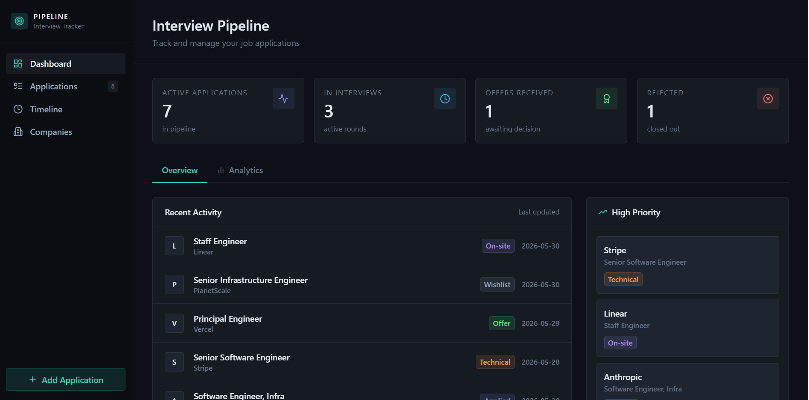
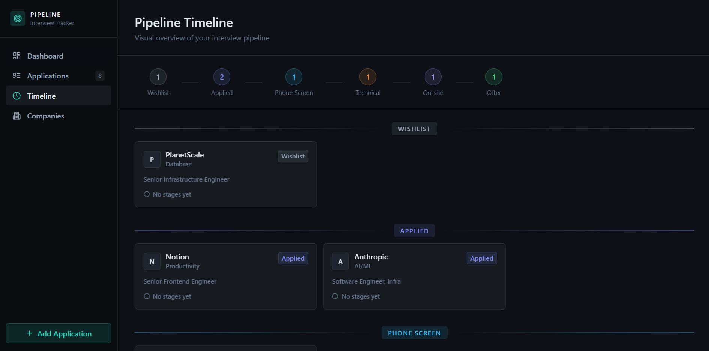
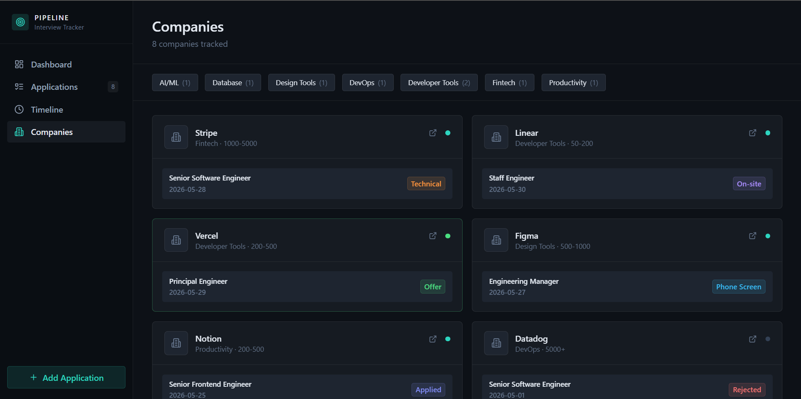

## README.md
Generate a README.md file in the project root with exactly this content:

  # Interview Pipeline Tracker

  A personal ATS (Applicant Tracking System) built to track job interviews, rounds, outcomes, and reflections — designed and developed by a Lead UX Designer as a portfolio project.

  ## Tech Stack
  - React + Vite
  - Tailwind CSS
  - Supabase (Auth + PostgreSQL database)
  - Figma Make (UI generation)

  ## Features
  - Email/password authentication (sign up, login, forgot password)
  - Add, edit, and delete interview entries
  - Track round type, outcome, confidence and difficulty ratings
  - Timeline view of all upcoming and past interviews
  - Stats dashboard — pass rate, total interviews, round-level breakdown
  - Row Level Security — each user sees only their own data
  - Mobile-responsive layout

  ## Local Setup

  ### 1. Clone the repo
  git clone https://github.com/YOUR_USERNAME/interview-pipeline-tracker.git
  cd interview-pipeline-tracker

  ### 2. Install dependencies
  npm install

  ### 3. Set up Supabase
  - Create a project at https://supabase.com
  - Run the SQL setup script from /docs/schema.sql in the Supabase SQL Editor
  - Copy your Project URL and anon key from Project Settings → API

  ### 4. Configure environment variables
  cp .env.example .env
  Then edit .env and fill in your Supabase credentials.

  ### 5. Run the app
  npm run dev

  ## Project Structure
  src/
  ├── components/       # Reusable UI components
  ├── pages/            # Auth and app screens
  ├── lib/              # Supabase client setup
  └── App.jsx           # Route definitions

## Screenshots

### Dashboard

### Application

### Timeline

### Companies

  ## Roadmap
  - Google Calendar sync for scheduled interviews
  - Email reminders before interviews
  - Export pipeline as PDF report
  - Company-level view grouping all rounds together
